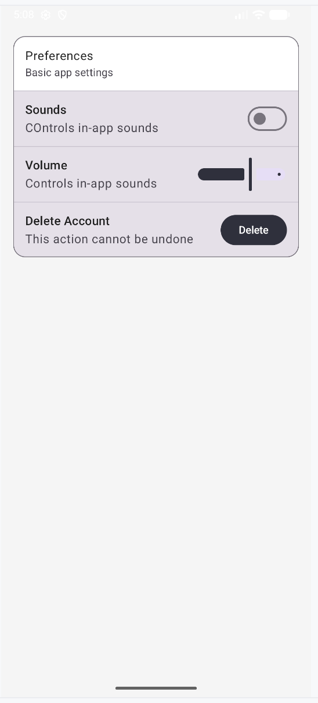

# Individual Assignment 3 - Q1 Settings Screen
## Settings Screen – Row/Column Mastery (Q1)
This project demonstrates a polished Settings screen built using Jetpack Compose and Material 3.

### Features
1. Column used as the main layout container
2. Each setting implemented as a Row with:
   **Left side:** label and supporting text
   **Right side:** interactive controls
3. Material 3 components such as Card, ListItem, Divider, Switch, Checkbox, and Button

### AI Disclosure
ChatGPT mainly helped me troubleshoot compile/deprecation issues (replacing Divider() with HorizontalDivider(), adding missing imports, and resolving state errors). It also aided in my issues with changing the color palette and how I should approach that hurdle. 
